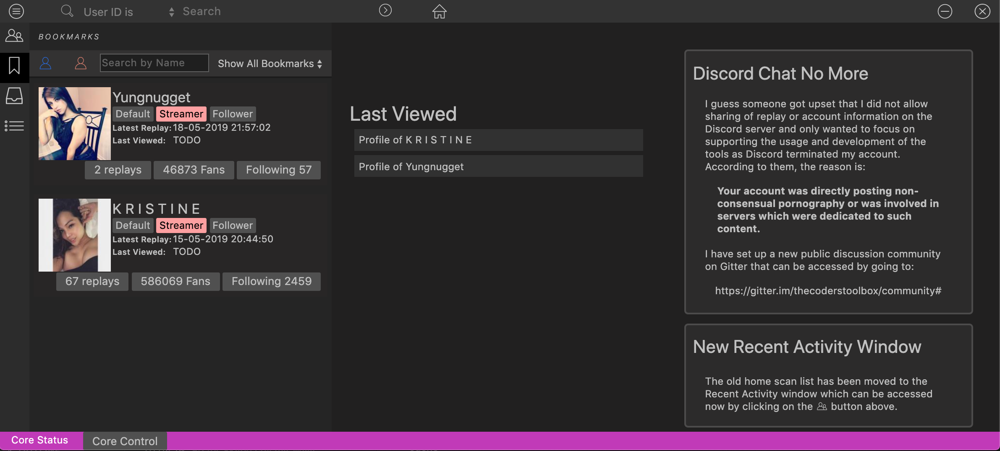

# LiveMe Pro Tools Core
A dotnet core port of the nodejs based LMPT.

**Work in progress**

## Developer Infos
### Prerequisites 
- dotnet core sdk Preview 3.0.100-preview5 http://github.com/dotnet/core-sdk

### How to Build
Run the build.sh script (Mac / Linux) or the build.ps1 script (Windows);

### Start the app
- Navigate to the artefacts folder and start the executable "LMPT.Core.Server"
- Open http://localhost:5788 in Chrome Browser

### What Is LiveMe Pro Tools?
An application for Live.me Social Video network for:
- Search and browse user accounts
- View public replays for user accounts
- See and navigate user's followers and followings
- Watch and download replays
- Allows downloading of replays using FFMPEG
- Supports [LAMD](https://notabug.org/thecoder75/lamd)

**Current Supported Platforms:**
- Ubuntu-based Linux and Debian Distributions (64-bit)
- macOS v10.11 or higher (64-bit only!)
- Windows 7 or higher (64-bit!)

** This project no longer supports 32-bit operating systems.**

#### Running Core on Windows 7
For windows 7 users please follow:
In addition to KB2999226, make sure you also have KB2533623 installed. 
https://docs.microsoft.com/en-us/dotnet/core/windows-prerequisites?tabs=netcore2x#net-core-dependencies

### FFMPEG Required?
FFMPEG is required to combined the downloaded playlist chunks and if transcoding of the downloaded replays are preferred.  There is no way at this time to download replays without having FFMPEG installed.

We are looking into building/rewriting the chunk downloader and removing the dependancy on FFMPEG in future versions.

### Contributing
If you find any bugs or would like to help add features or additional functions, please create a pull request for review and the current contributors will review it.  No guarantees are provided on if your pull request will be integrated or not. 

### Project Contributors
#### In no special order:
* [thecoder75](https://notabug.com/thecoder75)
* [zp](https://github.com/zp)
* [polydragon](https://github.com/polydragon)
* [lewdninja](https://github.com/lewdninja)
* [Tashiketh](https://notabug.org/Tashiketh)
* [monstergarden](https://notabug.org/monstergarden)

### License
This project is licensed under the GPL-3 License - see the [LICENSE](LICENSE) file for details

### Donations
**Please help keep this project alive!**
We appreciate those who wish to donate, but at this time we're not requiring or accepting them.  In the future, who knows.
